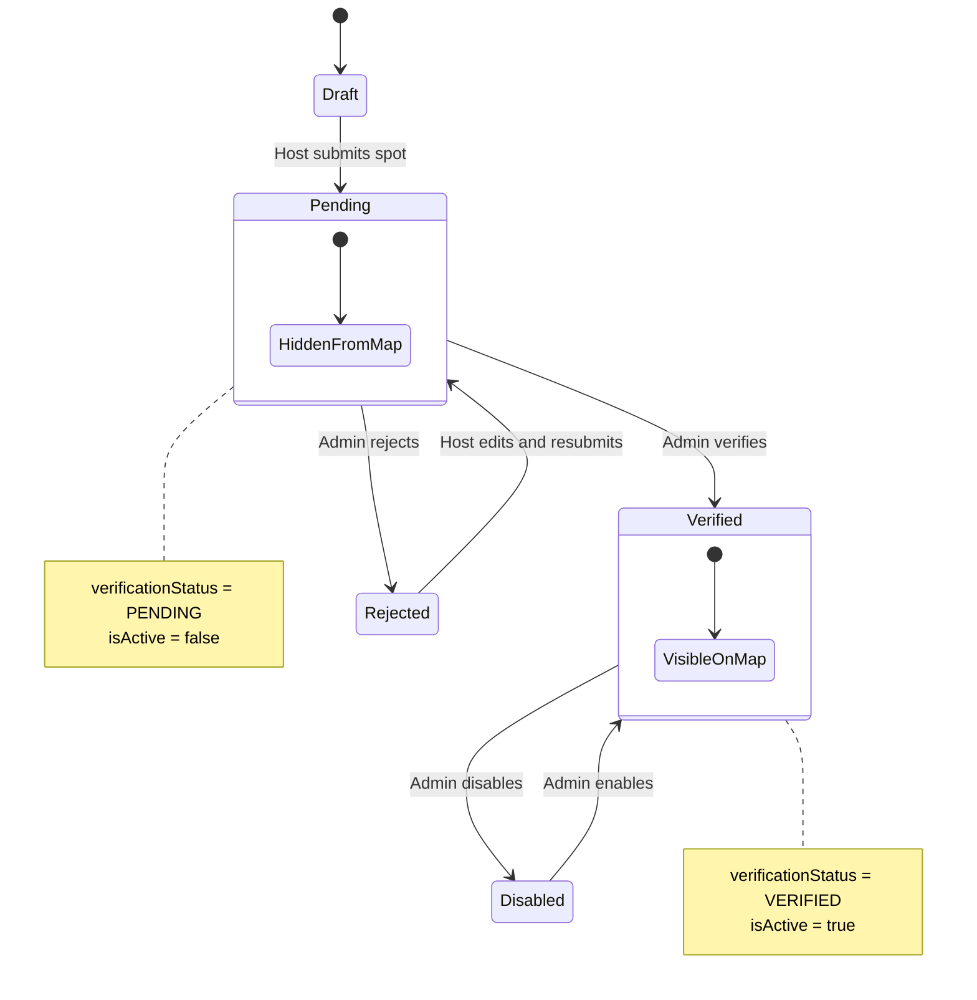

# Admin Moderation Flow

```mermaid
stateDiagram-v2
  [*] --> Draft
  Draft --> Pending: Host submits spot
  Pending --> Verified: Admin verifies
  Pending --> Rejected: Admin rejects
  Rejected --> Pending: Host edits and resubmits
  Verified --> Disabled: Admin disables
  Disabled --> Verified: Admin enables

  state Pending {
    [*] --> HiddenFromMap
  }

  state Verified {
    [*] --> VisibleOnMap
  }

  note right of Pending
    verificationStatus = PENDING
    isActive = false
  end note

  note right of Verified
    verificationStatus = VERIFIED
    isActive = true
  end note
```

## Summary

New host spots are not public immediately. Admin verification makes a spot visible on the map; admin disable hides a spot without deleting its history.
