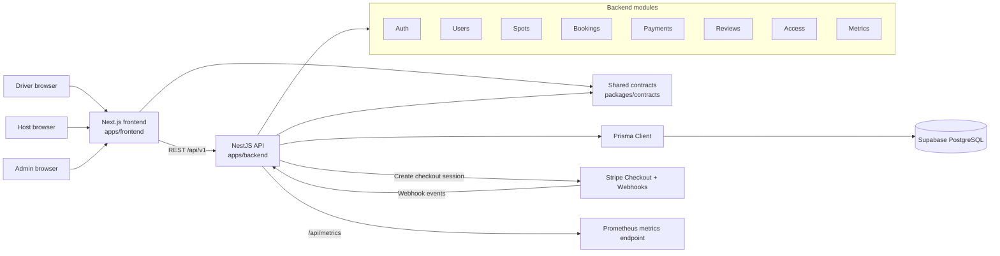

# Architecture Diagram

## Summary

ParkShare is a monorepo with a Next.js frontend, a NestJS backend, shared TypeScript contracts, Prisma, and Supabase PostgreSQL. Stripe handles card collection through Checkout, while the backend owns booking, payment, webhook, and moderation state.
