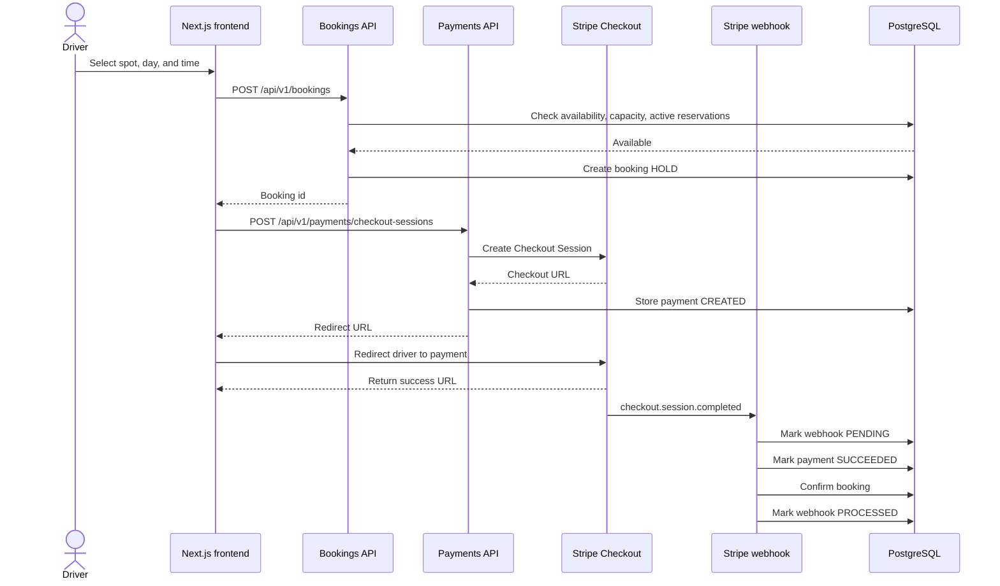

# Booking and Payment Flow

## Summary

The frontend never decides payment state. Stripe returns the user to the app, but the webhook is the source of truth that confirms payment and booking status.
