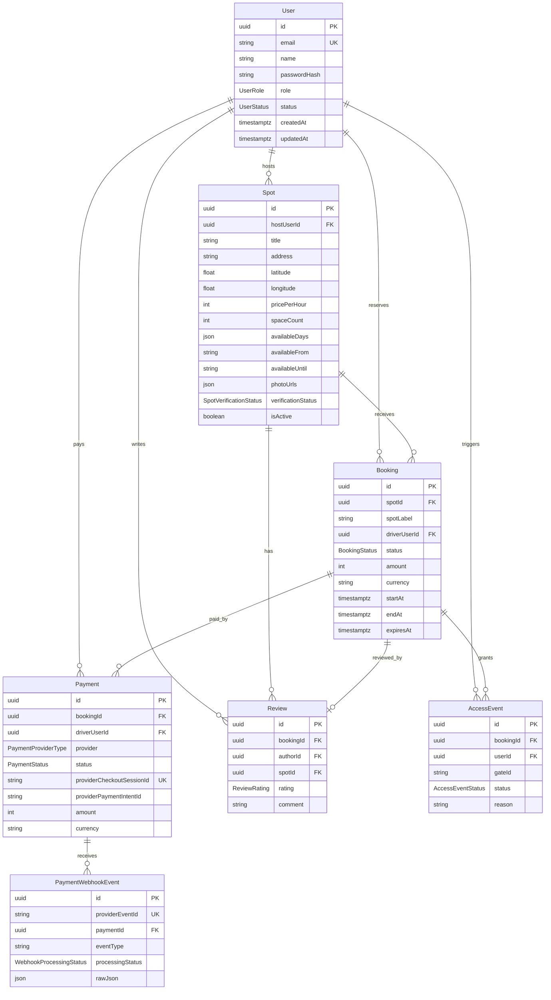

# Database Diagram

## Summary

The database centers on users, spots, bookings, and payments. Spots are created by hosts, verified by admins, reserved by drivers, paid through Stripe, and reviewed after completed bookings.
