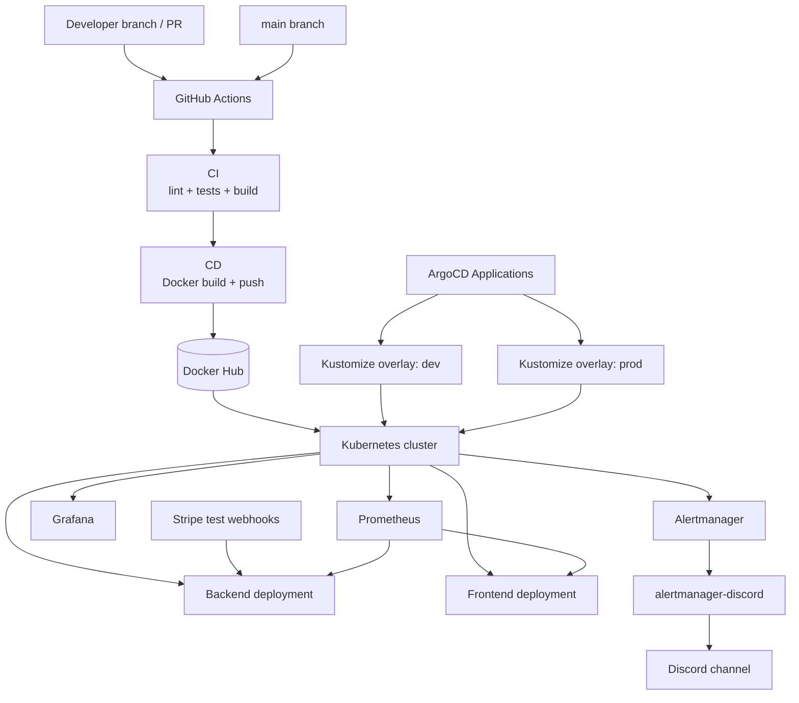

# Infrastructure Diagram

## Summary

GitHub Actions validates the monorepo and builds Docker images. ArgoCD applies Kubernetes manifests through Kustomize overlays. Prometheus, Grafana, Alertmanager, and the Discord bridge provide the observability path.
