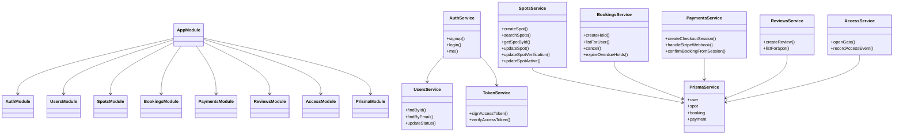

# UML Diagram

```mermaid
classDiagram
  class AppModule
  class AuthModule
  class UsersModule
  class SpotsModule
  class BookingsModule
  class PaymentsModule
  class ReviewsModule
  class AccessModule
  class PrismaModule

  class AuthService {
    +signup()
    +login()
    +me()
  }

  class TokenService {
    +signAccessToken()
    +verifyAccessToken()
  }

  class UsersService {
    +findById()
    +findByEmail()
    +updateStatus()
  }

  class SpotsService {
    +createSpot()
    +searchSpots()
    +getSpotById()
    +updateSpot()
    +updateSpotVerification()
    +updateSpotActive()
  }

  class BookingsService {
    +createHold()
    +listForUser()
    +cancel()
    +expireOverdueHolds()
  }

  class PaymentsService {
    +createCheckoutSession()
    +handleStripeWebhook()
    +confirmBookingFromSession()
  }

  class ReviewsService {
    +createReview()
    +listForSpot()
  }

  class AccessService {
    +openGate()
    +recordAccessEvent()
  }

  class PrismaService {
    +user
    +spot
    +booking
    +payment
  }

  AppModule --> AuthModule
  AppModule --> UsersModule
  AppModule --> SpotsModule
  AppModule --> BookingsModule
  AppModule --> PaymentsModule
  AppModule --> ReviewsModule
  AppModule --> AccessModule
  AppModule --> PrismaModule

  AuthService --> UsersService
  AuthService --> TokenService
  SpotsService --> PrismaService
  BookingsService --> PrismaService
  PaymentsService --> PrismaService
  ReviewsService --> PrismaService
  AccessService --> PrismaService
```

## Summary

Backend modules stay focused by domain. PrismaService owns persistence access, while Auth and guards protect role-based operations such as admin moderation.
